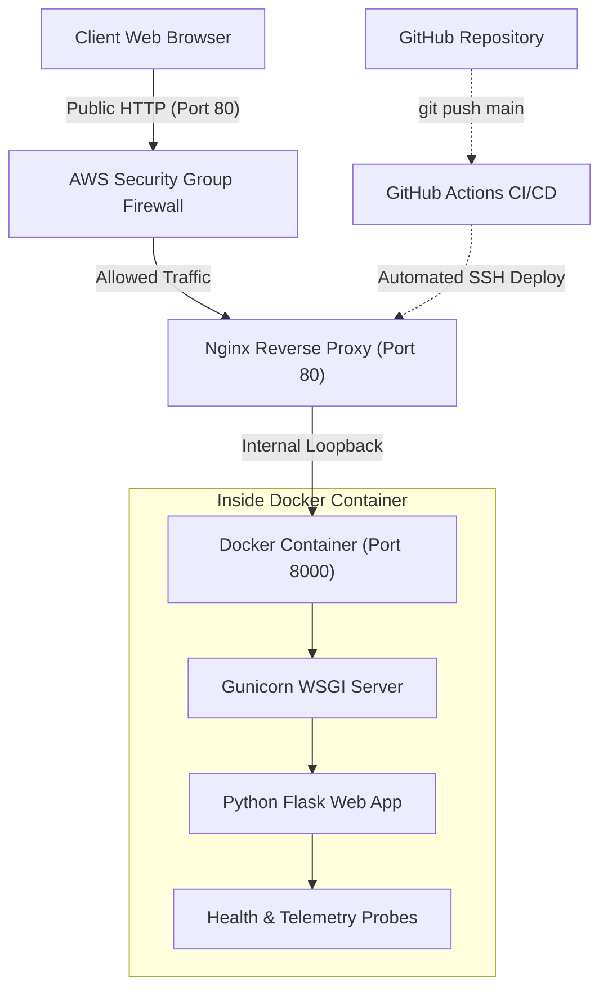

# AI-Assisted AWS Web App Deployment (DevOps Project 1)

[](https://aws.amazon.com/)
[](https://www.docker.com/)
[](https://nginx.org/)
[](https://python.org/)
[](https://github.com/features/actions)

An end-to-end cloud DevOps project deploying a containerized **AI DevOps Incident Assistant** on **Amazon Web Services (AWS)** using industry-standard DevOps fundamentals.

---

## Architecture Overview



---

## Necessary Tools and Prerequisites

Before starting, ensure you have the following installed or accessible:

| Tool | Version / Type | Purpose |
| :--- | :--- | :--- |
| **AWS Account** | Free Tier Eligible | Provision EC2 compute instances |
| **Git** | 2.x+ | Version control and remote repository synchronization |
| **Python** | 3.10+ / 3.11 | Application programming runtime |
| **Docker & Docker Desktop** | Latest | Containerization and image builds |
| **OpenSSH / PowerShell** | Built-in | Connecting to remote cloud servers via private key |
| **GitHub Account** | Free | Hosting repository and running GitHub Actions CI/CD |

---

## Project File Structure

```text
aws-devops-webapp/
├── .github/
│   └── workflows/
│       └── deploy.yml          # Automated CI/CD pipeline (Tests + SSH auto-deploy)
├── templates/
│   └── index.html              # Dashboard interface with live telemetry
├── static/
│   └── style.css               # Styling and responsive layout
├── app.py                      # Flask application, health probes & AI engine
├── requirements.txt            # Python dependencies (flask, gunicorn, psutil, requests)
├── Dockerfile                  # Production container definition (non-root security)
├── .dockerignore               # Excludes cache and git files from container
├── nginx.conf                  # Reverse proxy configuration (Port 80 -> Port 8000)
├── devops-app.service          # Linux Systemd unit file for auto-restart resilience
└── deploy.sh                   # Single-command automated EC2 bootstrap script
```

---

## Step-by-Step Hands-On Guide

### Step 1: Run and Verify Locally

1. **Clone the repository:**
   ```bash
   git clone https://github.com/Rishith17/AI-Assisted-AWS-Web-App-Deployment.git
   cd AI-Assisted-AWS-Web-App-Deployment
   ```

2. **Create a Python virtual environment and run the app:**
   ```bash
   python -m venv venv
   # On Windows:
   .\venv\Scripts\activate
   # On Mac/Linux:
   source venv/bin/activate

   pip install -r requirements.txt
   python app.py
   ```

3. **Verify in your browser:**
   * Dashboard: `http://localhost:8000`
   * Health Probe: `http://localhost:8000/health`

---

### Step 2: Containerize with Docker

1. **Build the Docker container image:**
   ```bash
   docker build -t cloudops-pulse:v1 .
   ```

2. **Run the container locally:**
   ```bash
   docker run -d --name devops-container -p 8000:8000 cloudops-pulse:v1
   ```

3. **Check container logs:**
   ```bash
   docker logs -f devops-container
   ```

---

### Step 3: Launch AWS EC2 Cloud Server

1. Log into the **AWS Management Console** -> Navigate to **EC2** -> Click **Launch Instance**.
2. Configure instance settings:
   * **Name:** `devops-server`
   * **AMI:** `Ubuntu Server 24.04 LTS` (Free Tier eligible)
   * **Instance Type:** `t2.micro` or `t3.micro` (Free Tier eligible)
   * **Key Pair:** Create a new RSA `.pem` key pair and download it (e.g., `oct5.pem`).
   * **Network Settings (Firewall / Security Group):**
     * Allow SSH traffic from anywhere (Port `22`)
     * Allow HTTP traffic from the internet (Port `80`)
3. Click **Launch Instance**.

---

### Step 4: Deploy on AWS with Nginx Reverse Proxy

1. **Connect to your EC2 instance via SSH:**
   ```powershell
   ssh -i "path/to/your-key.pem" ubuntu@<YOUR-EC2-PUBLIC-IP>
   ```

2. **Clone the repository on the EC2 server:**
   ```bash
   git clone https://github.com/Rishith17/AI-Assisted-AWS-Web-App-Deployment.git /home/ubuntu/aws-devops-webapp
   cd /home/ubuntu/aws-devops-webapp
   ```

3. **Run the automated deployment script:**
   ```bash
   chmod +x deploy.sh
   ./deploy.sh
   ```

4. **Run with Docker on EC2:**
   ```bash
   sudo apt-get install -y docker.io
   sudo docker build -t cloudops-pulse:v1 .
   sudo docker run -d --name devops-container --restart always -p 8000:8000 -e AWS_DEPLOYMENT=true -e CICD_ENABLED=true cloudops-pulse:v1
   ```

5. **Test in your browser:**
   Open: `http://<YOUR-EC2-PUBLIC-IP>` (All 5 DevOps phases will show active).

---

### Step 5: Automate with GitHub Actions (CI/CD)

1. Open your GitHub repository -> Go to **Settings** -> **Secrets and variables** -> **Actions**.
2. Add the following **Repository Secrets**:
   * `EC2_HOST`: Your instance's Public IPv4 address.
   * `EC2_SSH_KEY`: The entire content of your `.pem` private key file.
3. Every time you push a commit to `main`, GitHub Actions automatically:
   * Lints and validates Python code syntax.
   * Connects to your EC2 server over SSH.
   * Pulls the latest code and restarts the container with zero downtime.

---

## Essential DevOps Probes

* **`/health`**: Returns JSON `{"status": "HEALTHY", "uptime_seconds": 120}`. Used by AWS Application Load Balancers (ALB) and Kubernetes readiness probes.
* **`/api/metrics`**: Exposes real-time CPU utilization, RAM usage, cloud hostname, and container environment state.
* **`/api/ai-analyze`**: Analyzes terminal error logs (e.g., 502 Bad Gateway, Port conflicts, OOM) and provides actionable remediation commands.

---

## Quick Troubleshooting Guide

| Issue | Quick Diagnosis | Solution |
| :--- | :--- | :--- |
| **502 Bad Gateway** | Nginx cannot talk to backend port 8000 | `sudo docker ps` -> `sudo docker restart devops-container` |
| **SSH Timeout on Port 22** | EC2 was stopped or IP changed | Check AWS Console: ensure instance is **Running** and verify new Public IPv4 |
| **Permission Denied (SSH key)** | Key permissions are too open | Windows: `icacls key.pem /grant:r "$($env:USERNAME):(R)"`<br>Linux/Mac: `chmod 400 key.pem` |
| **Port 8000 Conflict** | Another process is using port 8000 | `sudo lsof -i :8000` -> `sudo kill -9 <PID>` |
| **Process Killed (OOM)** | Ran out of RAM on `t2.micro` | Enable a 2GB Swapfile: `sudo fallocate -l 2G /swapfile && sudo swapon /swapfile` |

---

## Author & Acknowledgments

* **Project Owner:** [Rishith17](https://github.com/Rishith17)
* **DevOps Focus:** AWS, Docker, Nginx, CI/CD Automation & Incident Diagnosis.
